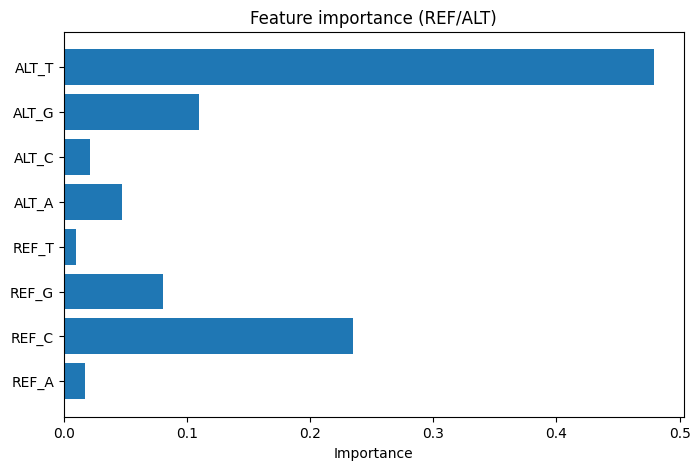

# Genetic Variant Classifications

A machine learning project for classifying genetic variants based on ClinVar data.

## 📋 Description

This project analyzes conflicting genetic variants from the ClinVar database and classifies them as **Benign** or **Pathogenic/Likely Pathogenic** using machine learning algorithms.

## 🎯 Key Features

- Loading and preprocessing ClinVar data
- Classification of genetic variants (Benign vs Pathogenic)
- Feature importance analysis for predictions
- Results visualization

## 📊 Data

The project uses the `clinvar_conflicting.csv` dataset, which contains information about genetic variants with conflicting interpretations of clinical significance.

### Main Features:
- **Genomic coordinates**: CHROM, POS, REF, ALT
- **Allele frequencies**: AF_ESP, AF_EXAC, AF_TGP
- **Clinical information**: CLNSIGINCL, CLNDN, CLNHGVS
- **Functional predictions**: SIFT, PolyPhen, CADD_PHRED, BLOSUM62
- **Annotations**: Consequence, IMPACT, SYMBOL, BIOTYPE

## 🔬 Methodology

1. **Data Preprocessing**:
   - Simplifying classification labels from CLNSIGINCL
   - Filtering ambiguous variants
   - Binary classification: 0 (Benign) and 1 (Pathogenic/Likely Pathogenic)

2. **Machine Learning**:
   - Random Forest Classifier implementation
   - Feature importance analysis for model interpretation

## 📈 Results



The chart shows the importance of various features for genetic variant classification.

## 🛠️ Technologies

- **Python 3.12**
- **pandas** - data processing
- **scikit-learn** - machine learning
- **matplotlib** - visualization
- **numpy** - numerical computations

## 🚀 Installation and Usage

1. Clone the repository:
```bash
git clone https://github.com/3x6dll9ff/Genetic_Variant__Classifications.git
cd Genetic_Variant__Classifications
```

2. Create a virtual environment:
```bash
python3.12 -m venv .venv
source .venv/bin/activate
```

3. Install dependencies:
```bash
pip install pandas scikit-learn matplotlib numpy seaborn jupyter
```

4. Launch Jupyter Notebook:
```bash
jupyter notebook "Genetic_Variant_ Classifications.ipynb"
```

## 📝 Project Structure

```
.
├── Genetic_Variant_ Classifications.ipynb  # Main analysis notebook
├── clinvar_conflicting.csv                 # ClinVar dataset
├── image.png                               # Feature importance visualization
├── .gitignore                              # Git ignore file
└── README.md                               # This file
```

## 📚 Data Sources

- [ClinVar Database](https://www.ncbi.nlm.nih.gov/clinvar/) - database of genetic variants and their clinical significance

## 👨‍💻 Author

Danila Kardashevskii

## 📄 License

MIT License
